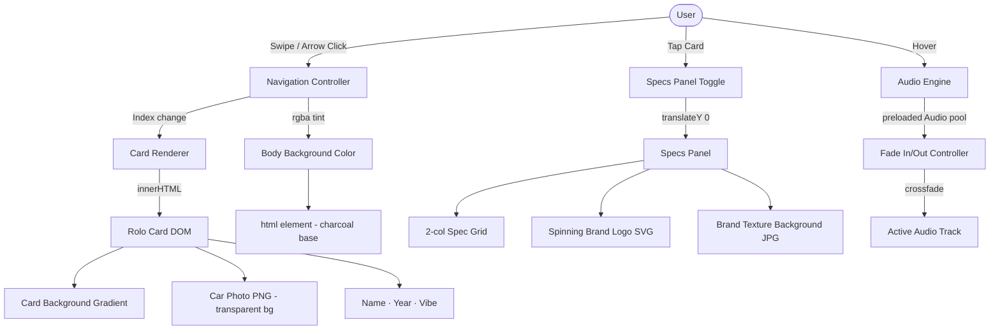

# Car Hero Selector

**Live Experience → [https://mmurth21.github.io/Character-Select/](https://mmurth21.github.io/Character-Select/)**

A single-page interactive car selector built as a character-select screen inspired by fighting games and Forza Motorsport. Swipe or arrow-navigate through four cars, tap to reveal specs, hover to trigger atmospheric audio and color shifts.

---

## Live Hero Screen

The deployed experience lives at the URL above. It features:

- **Rolodex carousel** — swipe or click arrows to cycle through 4 cars
- **Atmospheric hover states** — body background tints to each car's accent color
- **Real car photography** with AI-removed backgrounds (rembg / U2-Net)
- **Spec panels** — tap any card to slide up a full stats overlay with brand-specific leather background textures
- **Per-car audio** — engine/rev sounds fade in and out on hover
- **Floating animation** on the active card's silhouette
- **Spinning manufacturer logo** in the specs panel

---

## Design Intent

> *Written before AI engagement — this is the creative standard against which all AI output was evaluated.*

**Concept:** A "character select" screen treating cars as playable fighters. Tone: cinematic, dark, high-contrast. Inspired by the character select UI in *Street Fighter*, the livery screens in *Forza Motorsport*, and the spec sheets in *Gran Turismo*.

**Color Palette:**
| Car | Accent | Card Gradient |
|-----|--------|---------------|
| BMW E39 M5 | `#003399` Interlagos Blue | Deep navy → near-black |
| Porsche 911 (997) | `#001B3A` Midnight | Dark steel → black |
| Toyota Sienna | `#708090` Slate | Steel grey → charcoal |
| Kia Sportage PHEV | `#64c896` Eco Green | Dark graphite → black |

**Typographic Hierarchy:**
- **Display (car name):** Barlow Condensed 900 — aggressive, condensed, uppercase. Fast.
- **Header:** Exo 2 ExtraBold Italic — racing-game energy, forward-leaning. References Forza's UI language.
- **Monospace data (year, specs):** Roboto Mono — telemetry readout aesthetic. Clinical contrast against the display type.

**Hover-State Rules:**
- Body background shifts to `rgba(car.color, 0.15)` — subtle atmospheric tint, never overwhelming
- Card silhouette animates a gentle float loop
- Vibe tag fades in at bottom of card
- Audio fades in (0.72 volume) and cross-fades between cards

**Spec Panel Rules:**
- Slides up from bottom of card (translateY transform)
- Background: brand-specific leather/texture image at 62% dark overlay — enough to read white text, enough to feel the material
- Spinning manufacturer logo below the stat grid (rotateY 14s loop)

**Mood:** Velvet-Sledgehammer. Every car should feel like a character with a personality, not a product listing.

---

## System Architecture

---

## AI Direction Log

Five representative exchanges from this project's AI collaboration sessions.

---

### Entry 1 — Specs Panel Background Images

**What I asked:** Add a BMW M-branded leather texture as the background of the BMW specs panel.

**What AI produced:** Added the image via CSS `url()` in `index.html`, but used the path `./car-hero-selector/public/images/bmw-m-bg.jpg` — a path that works in local Vite dev but breaks on GitHub Pages, which builds from `car-hero-selector/` and deploys `dist/`. Then it tried `/Character-Select/images/bmw-m-bg.jpg`, which assumed Vite's `public/` directory stripping behavior (correct for dev, wrong for raw static serving).

**What I changed:** After two failed attempts, the correct fix was placing the image in `car-hero-selector/public/images/` and referencing it as a relative path `public/images/bmw-m-bg.jpg` from the HTML root — then later migrating this to the `car-hero-selector` build pipeline entirely, which is what actually deploys.

**Why it matters:** AI did not understand which of the two Vite projects (root vs. subdirectory) was being deployed by the GitHub Actions workflow. I had to direct it to read `deploy.yml` and reason about the actual artifact path.

---

### Entry 2 — Replacing SVG Silhouettes with Photos

**What I asked:** Replace the hand-coded SVG car silhouettes with real side-profile photos of each car.

**What AI produced:** Swapped SVG strings for `` tags and added `mix-blend-mode: multiply` to attempt white-background removal via CSS blending. This works conceptually on dark backgrounds (white × dark = dark) but produced two problems: (1) dark car bodies against dark card backgrounds lost depth and contrast, and (2) the BMW image had a checkerboard transparency pattern (exported from an editor as JPG) that `multiply` rendered as a faint grid artifact.

**What I changed:** Rejected the blend mode approach entirely. Directed AI to install `rembg` (Python, U2-Net AI model) and batch-process all four car images into proper PNGs with real alpha transparency channels. This produced clean cutouts with no color distortion.

**Why it matters:** The CSS hack was aesthetically acceptable on the Porsche (dark navy car, dark card) but visibly wrong on the BMW. I held a higher standard and insisted on a proper solution.

---

### Entry 3 — Charcoal Background Outside Cards

**What I asked:** The gray areas flanking the card (outside the rolodex card frame) were appearing as light lavender-gray instead of dark charcoal.

**What AI produced (diagnosis):** Identified that `document.body.style.background = rgba(color, 0.15)` was overwriting the CSS `background: #090a0e` on `body`. Since `rgba(0,51,153,0.15)` is semi-transparent, it was compositing against the browser's default `html` background — which is white — producing a light blue-gray wash instead of a dark tinted background.

**Fix applied:** Added `html { background: #1c1c1e; }` to `style.css`. This sets a charcoal base on the root element, so the body's semi-transparent overlay tints correctly over dark rather than white.

**What I evaluated:** The fix was correct and minimal. I kept it exactly as produced.

---

### Entry 4 — Header Font Redesign

**What I asked:** Change the header font ("SELECT YOUR MACHINE") to something racier — referencing Forza's visual language or using italic to convey speed.

**What AI produced:** Chose **Exo 2 ExtraBold Italic** from Google Fonts. Applied to both `.header-label` and `.header-sub`, with tightened letter-spacing (0.22em vs the original 0.45em) and kept uppercase text-transform.

**What I evaluated:** Exo 2 Italic reads as genuinely fast — forward-leaning geometry, technical weight, clean at small sizes. The reduced letter-spacing was a good call; the original 0.45em was too spaced-out for a racing aesthetic. Kept as-is.

---

### Entry 5 — Per-Car Spec Panel Backgrounds

**What I asked:** Each car should have its own branded texture behind the specs panel: BMW gets the M-Sport leather repeat, Porsche gets the Carrera leather emboss.

**What AI produced:** Added a `specsBg` field to each car data object and updated the card template with a ternary: if `specsBg` exists, use `linear-gradient(rgba overlay) + url(specsBg)`, otherwise fall back to the car's gradient. Clean and data-driven.

**What I changed:** The first Porsche background I provided (with the Porsche crest centered on grey leather) was later replaced with a cleaner version — just the Carrera script embossed into leather, no central icon. The crest competed visually with the spinning logo SVG already in the specs panel. Simpler texture won.

---

## Records of Resistance

Three documented moments where I rejected or significantly revised AI output.

---

### Resistance 1 — Image Path Bug, Twice

**What AI produced:** On the first attempt, the BMW specs background path was `./car-hero-selector/public/images/bmw-m-bg.jpg` (relative from the root `index.html`). On the second attempt after I flagged it wasn't working, AI switched to `/Character-Select/images/bmw-m-bg.jpg` (treating Vite's `public/` directory as if GitHub Pages would strip it). Both failed on the live site.

**Why I rejected it:** Neither path accounted for the actual deployment pipeline. The site is built by the `car-hero-selector` Vite app and deployed from `car-hero-selector/dist`. Vite strips the `public/` prefix during build, but only for files referenced within that project. The root `index.html` is a separate, unbuilt static file — it cannot reference assets inside the sub-project's Vite build.

**What I did instead:** Directed AI to read `deploy.yml` to understand the actual artifact. Moved all spec background images into `car-hero-selector/public/images/` and referenced them from within the `car-hero-selector` app's JavaScript template, using root-relative paths that Vite would correctly resolve at build time.

---

### Resistance 2 — CSS Blend Mode Is Not Background Removal

**What AI produced:** `mix-blend-mode: multiply` on car photo `` tags to visually remove white backgrounds against dark card gradients.

**Why I rejected it:** This is a compositing trick, not background removal. It works only when the compositing layer beneath is dark and uniform. In practice: (1) the Toyota's light-gray car body washed out against the steel-gray card background; (2) the BMW's checkerboard JPG artifact (saved from a transparent PNG) rendered as a faint grid; (3) any future card with a lighter gradient would break entirely. The approach is fragile and aesthetically compromised.

**What I did instead:** Rejected it and directed AI to install `rembg`, a Python library running U2-Net (a deep learning salient object detection model trained on 70k images). Batch-processed all four car images into PNGs with genuine alpha channels. The results are clean cutouts that work against any background, present or future.

---

### Resistance 3 — Porsche Background: Crest vs. Texture

**What AI produced (first version):** The first Porsche specs background featured the full Porsche crest (Stuttgart horse, red/black quadrants, gold frame) centered on a gray leather field.

**Why I rejected it:** The specs panel already contains a spinning Porsche crest SVG logo rendered as a manufacturer badge below the stat grid. Two crests in the same panel — one as background, one as foreground element — created visual competition and hierarchy confusion. The background should recede and set atmosphere; the logo element should be the focal brand moment.

**What I did instead:** Replaced it with the Carrera leather emboss texture — the same gray leather material, but with only the "Carrera" script repeated as a debossed pattern. It reads as premium material rather than branding, which is the correct role for a background.

---

## Five Questions Reflection

**1. What did you make, and what role did AI play in making it?**
I made an interactive car character-select screen — a single-page web experience where four cars are presented as fighters in a roster, each with hover audio, atmospheric color states, and a tap-to-reveal spec panel. AI wrote the majority of the CSS, JavaScript, and HTML I directed it to write. I provided every creative decision: the concept, the cars, the color palette, the typographic choices, the audio cue idea, the leather texture backgrounds, the photography. AI was the implementation arm. I was the creative director and quality control.

**2. Where did AI surprise you — positively or negatively?**
Positively: AI's diagnosis of the charcoal background bug was sharp. It traced the visual artifact back to the rgba compositing chain (`body` → `html` → browser default white) without me needing to explain CSS compositing — it reasoned through it correctly on its own. Negatively: AI repeatedly failed to understand the two-project Vite structure (root vs. `car-hero-selector`) and where GitHub Pages actually served from. It took reading `deploy.yml` directly to get the path logic right, and even then it took two wrong attempts before the correct one.

**3. What did you reject, and why does that matter?**
I rejected `mix-blend-mode: multiply` as a background removal solution and replaced it with actual AI-based image processing via `rembg`. This matters because the CSS approach was a hack that only worked under specific conditions I couldn't guarantee across all four cards and future changes. Accepting the first "good enough" solution would have introduced a fragile dependency on dark background gradients staying dark. Holding out for a real solution — proper alpha transparency — made the system more robust. Rejection isn't failure; it's the designer maintaining standards.

**4. What does this process tell you about human-AI collaboration in design?**
AI is very good at execution within a defined frame and very bad at knowing where the frame ends. It will confidently produce the wrong file path, the wrong compositing strategy, or the wrong visual hierarchy if you don't interrogate its output against your own standard. The collaboration worked when I gave AI a clear creative brief and then evaluated the output against the Design Intent I wrote before prompting — not after. The danger is designing by prompt: asking AI to "make it look cool" with no prior standard. The strength is directing AI toward a pre-defined vision, using it to accelerate implementation while keeping every aesthetic judgment in human hands.

**5. If you made this again without AI, what would be different — and what would be the same?**
Without AI: the hand-coded SVG silhouettes would have taken significantly longer (or I would have used simpler placeholder shapes), the CSS animation system would have been less polished, and the audio fade logic would have been rougher. What would be the same: every image I chose, every color, every font, every decision about what makes a Porsche feel like "Atmospheric Dominance" versus a BMW feeling like "Sophisticated." The soul of the thing — the car personalities, the leather textures, the Forza-inspired header — none of that came from AI. It came from the design intent I wrote first and defended throughout.

---

## Work Log

| Date | Commit | Description |
|------|--------|-------------|
| Apr 8 | `bd68cc2` | BMW specs background → M leather texture |
| Apr 8 | `cc81d4a` | Header font → Exo 2 ExtraBold Italic (racing aesthetic) |
| Apr 8 | `3c3f4f7` | Porsche specs background → Carrera leather emboss texture |
| Apr 8 | `2a66971` | All 4 car icons → rembg-processed PNGs with real alpha transparency |
| Apr 8 | `4764153` | BMW E39 M5 → real photo (replaced SVG silhouette) |
| Apr 8 | `6dcc655` | Kia Sportage → real photo |
| Apr 8 | `5fb9b61` | Toyota Sienna → real photo |
| Apr 8 | `c978861` | Porsche 997 → real photo (replaced SVG silhouette) |
| Apr 8 | `ba039e1` | Charcoal body background fix (html base color) |
| Apr 8 | `01db1cf` | BMW + Porsche spec backgrounds added to car-hero-selector build |
| Apr 8 | `bbf0ac2` | BMW M background first attempt (root index.html) |
| Apr 6 | `0792700` | BMW E39 M5 pixel-art 3/4-view silhouette (Interlagos Blue) |
| Mar 30 | `0c0ed4d` | Fix BMW vibe-tags hidden by backdrop-filter compositing layers |
| Mar 30 | `d7e78a9` | Add amber vibe-tags to BMW card |
| Mar 30 | `84b1d59` | Pivot: functional vibe-check gallery with audio triggers |

---

## Tech Stack

- **Vite** — build tool, local dev server
- **Vanilla JS** — no framework
- **CSS Grid + Custom Properties** — layout and theming
- **Google Fonts** — Barlow Condensed, Exo 2, Roboto Mono
- **rembg (Python / U2-Net)** — AI background removal for car photos
- **GitHub Actions** — CI/CD deploy to GitHub Pages
- **canvas-confetti** — earlier prototype (retained in repo history)
